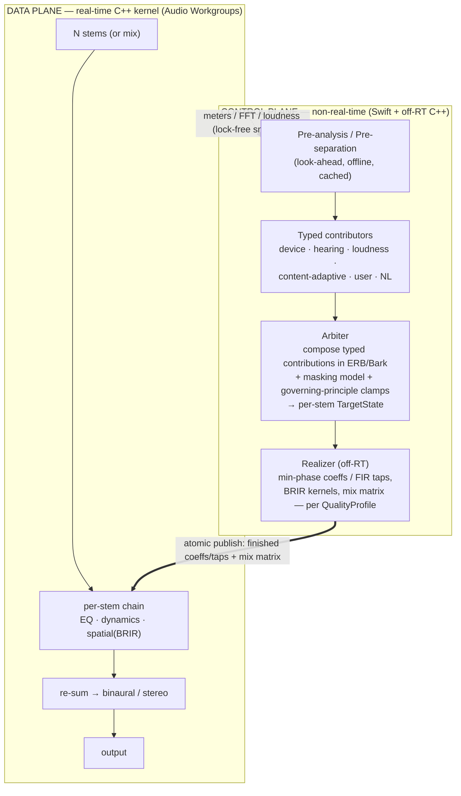

# Adaptive Sound — Architecture (v0.3)

**Status:** Canonical design · **Date:** 2026-06-13
**Supersedes:** [proposal.md](proposal.md) (v0.1). **Shaped by:** [proposal-review.md](proposal-review.md) (panel 1) + [review-v0.2.md](review-v0.2.md) (expert panel 2) + founder talk-through.

> **v0.3 (expert-panel fold-in):** **shared late-reverb** decomposition (not 6 independent BRIRs — the ~6× cost cut); **re-sum mixbus discipline** (loudness-matched per-stem trim); **bass + lead-vocal exempt from spatial spread**; masking re-scoped to the **excitation-pattern (ERB) subset** (full Moore-Glasberg is ~50× too slow); stems **gated on perceptual artifacts, not SDR**; BRIR room amount **content-adaptive**; Demucs **weights auto-downloaded on first run** (code MIT; NC-trained weights not redistributed), **MLX primary**; NL planned **on-device LLM + SAFE/SocialEQ priors** (mechanism still deferred) with **untrusted-output clamping**; global tap reframed as a **high-consent, captures-everything** capability. Detail: [review-v0.2.md](review-v0.2.md).
**Companion docs:** [prior-art.md](prior-art.md) · [../product/PRD.md](../product/PRD.md) · [../product/requirements.md](../product/requirements.md) · [../product/backlog.md](../product/backlog.md)

> One-line: **turn any good-quality song into a personal, perceptually-tuned, spatially-rendered mix you can steer in plain language** — on modern Macs, headphones or speakers.

---

## 0. Locked decisions & ADR registry

Canonical decision registry for the architecture. Product/scope locked decisions live in PRD §0 (LD-1…LD-10) and are extended here (LD-11…LD-19).

| LD | Decision |
|---|---|
| LD-1…LD-10 | (PRD §0) own-player→system-wide; immersive=spatial+tonal; both outputs; local-files MVP; phased content brain; on-demand mic; generic HRTF→**now BRIR, see LD-14**; Conversational Tuning (governing principle, session-scoped); personal/OSS; quality-first/ample-hardware. |
| **LD-11** | **Source quality & non-goals.** Assume reasonably good sources (lossless / high-bitrate). **Audio repair/restoration is a non-goal** (no de-noise/de-clip/upsample to "fix" bad audio). Network may be used for non-sensitive, latency-tolerant work; **core playback + RT DSP stay offline-capable.** |
| **LD-12** | **Perceptual tonal model.** Clarity/adaptive decisions are made in **ERB/Bark with a masking + partial-loudness model**, not raw dB-on-log. Contributors are **typed** (EQ-curve + per-band dynamic + transient + spatial), not a single magnitude curve. The dB curve is a *realization/interchange* format only. |
| **LD-13** | **Phase realization = minimum-phase by default.** Phase mode is chosen by **content** (transient density from pre-analysis); linear/mixed-phase is opt-in or band-limited where it genuinely helps. (Pre-ringing, not latency, is the real cost.) |
| **LD-14** | **BRIR-first immersion.** Headphone spatialization defaults to a **binaural room response** (HRTF + early reflections + late reverb); dry HRTF is a "minimal" mode. Head-tracking is **opt-in** for music. Speaker immersion = **M/S width + ambience extraction (mono-safe)**; crosstalk-cancellation is opt-in (centered near-field only). Crossfeed opt-in. |
| **LD-15** | **Stem-based object engine** (Phase 1.5). Offline **6-stem** separation (vocals/drums/bass/guitar/piano/other), cached; **full per-stem chains incl. spatial placement**, re-summed to binaural; **masking computed between stems**. **Own-player-only** (live tap path is mix-only); real-time-lite separation is a research track. |
| **LD-16** | **"Reimagine" intensity** = one continuous control. **0% = original mix, stem engine bypassed (bit-faithful, zero separation artifacts)** → rising = clarity → spatial widening → **100% = full stem-based spatial reimagining**. Crossfades original↔stem-render + scales spatial spread / unmask depth. Mix-range in Phase 1; stem-range unlocked in Phase 1.5. |
| **LD-17** | **Dynamics & loudness.** **No program DRC by default** (transparent LUFS normalization + true-peak safety limiter only). Loudness compensation = **fraction of the equal-loudness contour *difference*** + per-device SPL calibration + loudness-matched makeup, **rate-limited to volume changes**. |
| **LD-18** | **Target hardware & runtime posture.** Floor = **Apple-Silicon Pro-class (M1 Pro) with ≥16 GB**; anything that runs this is stronger. The app is the **foreground, primary activity** ("lean-back listening," not background multitasking), so it may **use multiple cores and occupy memory generously**. Supersedes the base-model-8 GB-Air framing in §15 (materially reduces that risk); still degrade gracefully if backgrounded or if other apps run. **Power:** default max-quality on AC; auto-switch to the Efficiency profile on battery (user-overridable). |
| **LD-19** | **App shape.** A focused **full-window listening experience** (now-playing + scene visualizer + the Reimagine dial) **plus a menu-bar extra** for quick control (toggle / volume / Reimagine). Both surfaces share one app-level audio engine. |

**ADRs** (details in §18): **Accepted —** 001 Foundation · 002 Phase-2 taps · 003 BRIR-first spatial · 004 BNNS-Graph RT ML · 005 vDSP feature analysis · 006 Perceptual typed-contributor model + off-RT Realizer (min-phase default) · 007 Stem object engine · 008 Reimagine intensity · 009 NL typed-macro (mechanism deferred) · 010 Dynamics/loudness policy.

---

## 1. Objectives, assumptions, non-goals

**Objective.** An **immersive** music experience on **modern capable Apple-Silicon Macs (M1 Pro / 16 GB floor and up; LD-18)**, on headphones & speakers, that lets the listener **actually hear what's being played** (clarity, detail, correct balance, externalized stage), and that **adapts dynamically** — automatically and via the user's **abstract natural-language guidelines**.

**Assumptions:** ample CPU/RAM/network (LD-10); good-quality sources (LD-11); macOS / Apple-Silicon-first; own-player latency is free (we are the clock).
**Non-goals:** audio repair/restoration (LD-11); lyrics/recommendation; Windows/DAW-plugin formats.

---

## 2. Architecture at a glance

A constant **spine**: a non-real-time **control plane** decides *what the sound should be*; a real-time **data plane** renders it. They communicate via a lock-free parameter snapshot down and a lock-free meter/analysis snapshot up.

**RT rules (every kernel line):** no heap alloc, no locks, no Obj-C/Swift runtime, no I/O; pre-allocate; bounded deterministic work per buffer; cross-thread state via atomic snapshot + ramping; the **Realizer does all design/fitting off-RT** — the kernel only ramps & runs finished coefficients.

---

## 3. Foundation (ADR-001)

AVAudioEngine host + **one custom `AUAudioUnit` (v3)** whose render block calls a **C++ DSP kernel**; Swift↔C++ via **Swift/C++ interop** + small facade. AVAudioEngine owns decode, format/SR conversion, device routing, the render thread. Reference: `bradhowes/LPF` (MIT); Apple `AudioUnitSDK` (Apache-2.0).

## 4. The signal model — typed contributors, perceptual decisions (LD-12)

The tonal/spatial/dynamic state is **not** a single dB curve. Each source contributes a **typed contribution**:

| Contributor | Emits |
|---|---|
| Device correction | EQ curve (to target) |
| Hearing profile | per-ear EQ curve |
| Loudness compensation | volume-dependent EQ curve (fractional contour-diff, LD-17) |
| Content-adaptive | EQ + dynamic-EQ + (per-stem) balance moves |
| Masking/clarity | dynamic per-band gain (ERB/Bark, between-stem) |
| User manual | typed moves |
| Natural-language | typed **macro** (multi-band EQ + dynamics + transient + spatial + target-stem), governing-principle |

**Arbiter** composes contributions **in the perceptual (ERB/Bark) domain** using a masking model — the affordable **excitation-pattern / masked-threshold (ERB) subset**, *not* full time-varying Moore-Glasberg partial loudness (which is ~50× too slow per channel and has no shippable implementation) — enforces **governing-principle clamps** (locked-band/macro records written on NL-confirm, cleared on undo/session-end), and emits a **per-stem `TargetState`** (EQ curve + dynamics + transient + spatial placement + level). The **re-sum is a managed mixbus** (§9), not a passive adder.

**Realizer (off-RT)** turns each `TargetState` into finished, ready-to-run artifacts per the active **QualityProfile**: **minimum-phase** biquad cascades (default) or **linear/mixed-phase FIR** (opt-in / content-permitting, LD-13); BRIR convolution kernels; the stem-mix matrix. Biquad fitting: NLLS/Levenberg-Marquardt (or IIRNet, MIT), **ERB/masking-weighted**, fit to the **min-phase target**, error budget ≤ ±1 dB. *Nothing is designed/fitted on the RT thread.*

## 5. The "Reimagine" intensity control (LD-16)

A single continuous knob governs *how much we transform*:

| Intensity | Behavior |
|---|---|
| **0%** | Original mix, stem engine bypassed — **bit-faithful**, zero separation artifacts (this is the "hear exactly what's played" anchor) |
| Low | Subtle masking-aware clarity + gentle BRIR externalization; sources near original places |
| Mid | Audible clarity + spatial widening; stems placed in the virtual room |
| High | Full reimagining: active per-stem spatial placement + aggressive unmask/rebalance (separation artifacts most exposed — accepted here) |

Mechanism: **crossfade original↔stem-render** + scale spatial spread / unmask depth. **Phase 1** implements the mix-level range; **Phase 1.5** raises the ceiling into the stem-based range. (Open: the exact intensity→parameter mapping curve — OQ.)

**v0.3 review fixes (mastering panel):** the **default sits low-to-lower-mid** (the musical sweet spot), not at the top. There is a small **dead-band above 0%** so leaving the bit-perfect anchor doesn't crossfade the original against an imperfect-phase stem-sum (avoids a discontinuity/comb and the mid-knob "quality valley"). The render is **loudness-matched across the whole knob** so A/B isn't biased by level. **Bass and the lead vocal are exempt from spatial spreading at every intensity** (§7).

## 6. Stem-based object engine (Phase 1.5 · LD-15)

Pre-separation pipeline: on add/first-play, run **Demucs 6-stem** offline (**MLX primary**, Core ML secondary — STFT/complex ops don't convert cleanly; runs on GPU, ~seconds/track, latency-free), **cache stems to SSD** (FLAC; bounded LRU, ~120–160 MB/track). Code is MIT; the **model weights are auto-downloaded on first run** — NC-trained, so *not* redistributed in the repo (keeps it MIT/Apache-clean and setup one-tap, per the founder's open-source + minimal-setup steer). The kernel renders **N stem-objects** — each its own EQ + dynamics + **spatial placement** — but through a **shared late-reverb tail + a cheap per-stem early/direct filter**, *not* 6 independent full BRIRs (the ~6× cost cut; §7, §15). **Bass (≲120 Hz) is high-passed out of the spatial path and summed mono; the lead vocal stays centered** (review C4). Masking/unmasking is computed **between stems** (ERB subset, §4); NL macros can **target a stem** ("bring up the guitar"). Stems are **gated on a perceptual-artifact estimate (not SDR)** — guitar/piano are the least-robust 6-stem case; poor stems fold into "other" / fewer stems, and confidence **clamps the per-track Reimagine ceiling**. **Own-player-only**, and **stems are only ever derived from user-supplied local files — never tapped/DRM audio**; the live tap path (Phase 2) is mix-level; real-time-lite separation is a research track.

## 7. Spatial / immersion (LD-14 · ADR-003)

- **Headphones — BRIR-first.** Convolve with a **binaural room response** (HRTF + early reflections + late reverb carrying interaural difference); dry SADIE-II HRIR is the anechoic core *inside* the BRIR; headphone-correction EQ is for **timbre only** (it does not externalize). Synthesize the room (image-source + FDN) or use CC0/CC-BY IRs. **Head-tracking opt-in** (`CMHeadphoneMotionManager`, macOS 14+). Loader: `libmysofa` (BSD-3); convolution via vDSP / FFTConvolver (MIT).
  - **v0.3:** one **shared late-reverb tail across stems** + cheap per-stem early/direct filters (not one full BRIR per stem). **Room amount is content-adaptive** — less on already-reverberant material (avoid reverb-on-reverb wash that *reduces* clarity), more on dry sources. **Bass excluded from the BRIR path + summed mono; lead vocal kept centered** (depth/early-reflections allowed, not L/R spread) — binaural-izing bass or a centered vocal combs and destabilizes the phantom center.
- **Speakers.** **M/S width + ambience extraction with hard mono-compatibility** (preserve the M channel). Crosstalk-cancellation/transaural is an opt-in "centered near-field desk" mode (stereo-dipole narrow span) — never aggressive XTC blind on laptop speakers.

## 8. Tonal / EQ realization (LD-13)

Minimum-phase by default (FabFilter-style); **content-driven** phase selection (transient-dense → min-phase even in player). Linear/mixed/low-latency-linear-phase as opt-in for material where group-delay linearity matters. Realized off-RT (§4).

## 9. Dynamics & loudness (LD-17 · ADR-010)

- **Re-sum mixbus (review C3 · ADR-011):** the per-stem chains sum through a *managed bus*, not a passive adder — **per-stem makeup ≤ gain-reduction removed** (no net loudness from per-stem dynamics), a **loudness-matched per-stem trim** so the sum's loudness + spectral centroid track the intensity-0 reference, a **headroom budget** (~−6…−3 dBFS pre-limiter so the safety limiter rarely engages), and **metered limiter gain-reduction** so "transparent" is verifiable. Centered content (kick/snare/bass/lead vocal) is group-delay-aligned to limit comb filtering on re-sum.
- **Dynamics:** transparent **LUFS normalization** + a **true-peak safety limiter** (≥4× oversampling, −1 dBTP, ~1 ms look-ahead, ITU-R BS.1770-5). **No program DRC by default**; if any, prefer **dynamic EQ** over multiband compression.
- **Loudness compensation:** a **fraction** of the equal-loudness **contour difference** (ISO 226) between an assumed program reference and the actual playback level; requires a **per-device SPL calibration**; **loudness-matched makeup**; **rate-limited to volume changes** (never program dynamics). Defeatable.
- **Psychoacoustic bass:** multiband + transient/steady-state hybrid NLD, **mono-summed**, **device/SPL-gated** (only when the transducer can't reproduce the fundamental). ⚠ Patent: mono-sum avoids Waves US-11,102,577; IP review before release (OQ-16).

## 10. Adaptivity engine + pre-analysis (LD-5, LD-6)

Pure functions `signal → typed contribution`. **Pre-analysis** scans ahead (up to full track), parallelized across cores/ANE, cached: LUFS, true-peak, dynamic range, spectral balance, genre/mood, transient density, (Phase 1.5) per-stem features. **Ambient mic is on-demand only** (LD-6: ~3 s sample, then released — no continuous polling). Adaptation cadence is **conservative**: coalesced updates, slow ramps, hysteresis/deadbands; it must **never be perceived as "the EQ moving"** (a Phase-0 KPI) and must not fight intentional musical contrast.

## 11. Natural-language layer (ADR-009, refines LD-8)

Interface (mechanism deferred — OQ-11): `interpret(text, context) → { eq_bands[], dynamics?, transient?, spatial?, target_stem?, confidence } | clarification`. A NL utterance becomes a **typed multi-band macro**, optionally targeting a stem, entered as a **governing principle** (clamps the regions it touches; auto-contributors adapt around it). Seed mappings from **SAFE-DB / SocialEQ** priors; expect **low cross-user agreement** → make terms per-user-adaptable; if CLAP/LLM back-ends are used, **validate monotonicity** (some embeddings invert "warm"). `context` must **exclude** audio buffers and hearing-profile data (privacy, §14).

**v0.3 (ML panel):** the evidence leans to a **small on-device LLM + SAFE/SocialEQ priors (few-shot/RAG)** as the planned primary back-end — CLAP-embedding optimization scored ≈ random for EQ, so it's demoted to a **retrieval/reranker**; deterministic **rules are the floor**; cloud is **opt-in only**. *The mechanism itself stays deferred (OQ-11)* — only the lean is recorded. The interpreter's output is treated as **untrusted**: schema-validated + **numeric-clamped** to the governing-principle and **hearing-safety** limits (bounds prompt-injection + hallucination). `context` is a **field allowlist** — excludes audio, hearing data, **and** track identity / listening history.

## 12. ML placement

| Task | Where | Tech |
|---|---|---|
| Source separation (6-stem) | **offline** pre-pass, cached | Demucs/HTDemucs — **MLX primary**, Core ML secondary; **code MIT, weights auto-downloaded on first run** (NC-trained → not redistributed) |
| Masking (between-stem / clarity) | off-RT control | vDSP — **excitation-pattern / masked-threshold (ERB) subset** (not full Moore-Glasberg) |
| Genre/mood | off-RT pre-analysis | Create ML-trained → Core ML / SoundAnalysis |
| Feature analysis (BPM/key/spectral) | off-RT | vDSP (librosa ISC as reference) |
| NL interpretation | off-RT (mechanism deferred) | rules / CLAP / on-device or cloud LLM |
| **Real-time** ML (if any) | **render thread** | **BNNS Graph** only — *contingent: no RT ML is currently needed; reserved escape hatch (ADR-004)* |

## 13. Phase 2 — system-wide (ADR-002)

Core Audio **process taps** (macOS 14.2/14.4+): muted global tap + private aggregate device → capture, run the **same kernel** (BoundedLatency profile, **mix-level**), replay — no HAL driver/sudo. AudioServerPlugIn (libASPL, MIT) is the **fallback** for older macOS. **Stem features are own-player-only**; the tap path is mix-only.

**v0.3 (security panel C9):** the muted global tap is a **high-consent, captures-everything capability** — it fires a TCC system-audio-recording prompt + the **purple recording indicator** (screen-recording-class) and ingests *all* apps' audio, **including calls**. Therefore: an explicit pre-prompt explainer; **auto-exclude/skip communication apps** (FaceTime/Zoom/Teams) by default; **tapped audio is never persisted** and never feeds stem separation; verify the exact Info.plist key (`NSAudioCaptureUsageDescription`?) + min-OS (14.2 vs 14.4) in the SDK headers.

## 14. Cross-cutting

- **Param bus:** Arbiter→Realizer publishes a **per-stem TargetState→finished-coeffs snapshot** atomically (double/triple-buffer); RT reads latest + ramps (≥50 ms). Events (load IR/stems) via SPSC. Meters/FFT/loudness up via seqlock/ring, polled by a UI timer (≥30 fps for the analyzer; ≥2 Hz for the transparency view).
- **Threading / Audio Workgroups:** with up to **6 stems × full chains × BRIR convolution**, the render uses **`os_workgroup`** to fan parallel per-stem work across cores while holding the per-buffer deadline.
- **Privacy (NFR-PRIV):** mic → SPL scalar only, never transmitted; hearing profile encrypted on-device, excluded from backup; cloud-LLM `context` excludes audio/hearing data; graceful offline fallback (LD-11).
- **Quality floor (NFR-QUAL):** the **bit-transparent path = intensity 0** (verified MD5-equal bypass); THD+N budget tracked across the chain; validated at 44.1/48/88.2/96 kHz.
- **Persistence:** device↔profile binding; session-scoped NL principles with explicit save; cached stems + pre-analysis.

## 15. Performance & feasibility budget ⚠ (key review target)

The ambition (6 stems × per-stem EQ/dynamics/**BRIR convolution** + masking) is the **chief feasibility risk**. Mitigations: heavy work is **off-RT** (separation, FIR/BRIR design, masking analysis — all pre-computed/cached); the RT kernel runs **fixed, partitioned convolutions** parallelized via **Audio Workgroups**; **QualityProfile** scales partition sizes / stem count / convolution length under battery/thermal. **The raised hardware floor + sole-occupancy posture (LD-18) materially reduce this risk** vs. an 8 GB fanless Air — an M1 Pro has more performance cores, a fan, and ample RAM, and the app need not share the machine. The **shared-late-reverb decomposition** (one room tail + cheap per-stem placement filters) is now the **planned approach** (v0.3, §6/§7) — it cuts the dominant convolution cost ~6× (turns "6 long convolutions" into "1 long + 6 cheap"). **Hardware context:** the shipping generation sits well above the floor — M4 (38-TOPS NE, ~120 GB/s) → M4 Pro/Max (10–12 P-cores, 273–546 GB/s, 64–128 GB) and M5 (per-GPU-core neural accelerators, ~4× M4 GPU-AI compute, 153 GB/s) — i.e. ~3–4× the floor for this AI/convolution work, so on shipping hardware the risk is **Low** and the spike is for tuning QualityProfile caps, not go/no-go. **Open:** measured per-stem RT cost, total memory for 6 cached stems + BRIR kernels, and the worst-case render budget on **the M1 Pro / 16 GB floor** (spike before Phase 1.5 — see backlog).

## 16. Phasing

| Phase | Scope |
|---|---|
| **0 — Player MVP** | Local-file playback through the kernel; param bus; passthrough → first DSP |
| **1 — Mix-based core** | Perceptual tonal/clarity, correction, loudness-comp, adaptive engine, **BRIR** immersion, NL (typed-macro, mix-level), **Reimagine knob (mix range)** |
| **1.5 — Stem object engine** | Offline 6-stem separation + per-stem chains + spatial placement; between-stem masking; per-stem NL; **Reimagine knob (stem range)** |
| **2 — System-wide** | Process-tap path (mix-level), libASPL fallback |

## 17. Open questions & risks

- **Feasibility budget** (§15) — *must spike before Phase 1.5.*
- **6-stem separation quality/artifacts** (guitar/piano) — quality-gating policy.
- **Reimagine intensity→parameter mapping curve** — define & user-test.
- **Masking model** — resolved toward the **excitation-pattern / masked-threshold (ERB) subset** (v0.3, §4); remaining: exact spreading function, and whether masking-aware unmask beats naive level-match (SPIKE-MASKING-MODEL).
- OQ-11 NL mechanism (deferred) · OQ-15b/c reconciliation defaults · OQ-16 bass IP review · OQ-17 libbs2b license · OQ-18 min-phase-vs-linear per content.
- Separation isn't lossless → at high Reimagine intensity, artifacts are exposed by design; the intensity-0 anchor + quality-gating + conservative defaults manage this.

## 18. ADR details

**v0.3 amendments (expert panel — see [review-v0.2.md](review-v0.2.md)):** ADR-002 +tap is high-consent (TCC + purple indicator; auto-exclude comms apps; never persist); ADR-003 +shared late-reverb, content-adaptive room, bass/lead-vocal spatial exemptions; **ADR-004 → contingent** (no RT ML currently needed — reserved escape hatch); ADR-006 +masking = excitation-pattern (ERB) subset; ADR-007 +shared-reverb decomposition, MLX-primary, weights download-on-first-run, gate on perceptual artifacts (not SDR); ADR-008 +default low-to-mid, dead-band above 0%, loudness-matched across the knob; ADR-009 +planned on-device LLM + priors (CLAP demoted), output clamped/validated (mechanism still deferred). **New: ADR-011.**

- **ADR-001 (Accepted):** AVAudioEngine + single custom AU (C++ kernel), Swift/C++ interop. *Consequence:* fast to first sound; the kernel is reused in the Phase-2 tap path.
- **ADR-002 (Accepted):** Phase-2 = process taps primary, libASPL fallback. *Consequence:* no driver for most users; stem features can't apply to live audio.
- **ADR-003 (Accepted, rewritten):** BRIR-first spatial; dry HRTF = minimal mode; head-tracking opt-in. *Consequence:* externalization actually works; needs a BRIR set + room synthesis.
- **ADR-004 (Accepted):** RT ML via BNNS Graph; Core ML/Create ML off-RT. *Consequence:* RT-safe ML; analysis ML stays off the render thread.
- **ADR-005 (Accepted):** vDSP feature analysis (librosa ISC reference). *Consequence:* avoids GPL MIR libs; more engineering.
- **ADR-006 (Accepted, rewritten):** typed contributors + ERB/Bark perceptual decisions + masking model + off-RT Realizer (min-phase default, content-driven phase). *Consequence:* real clarity gains; more complex Arbiter; dB-curve demoted to realization format.
- **ADR-007 (Accepted):** stem-based object engine — offline 6-stem, full per-stem chains incl. spatial, Phase 1.5, own-player-only. *Consequence:* signature capability; large compute/feasibility risk (§15); artifacts at high intensity.
- **ADR-008 (Accepted):** single Reimagine intensity control (0 = original bypass → full reimagine). *Consequence:* one honest control spanning fidelity↔transformation; needs a tuned mapping curve.
- **ADR-009 (Accepted):** NL typed-macro interface + per-stem targeting + SAFE/SocialEQ priors; interpretation mechanism deferred. *Consequence:* unblocks downstream design while keeping the model choice open; needs a validation harness.
- **ADR-010 (Accepted):** dynamics = LUFS-normalize + true-peak limiter, no program DRC default; loudness-comp = fractional contour-difference + SPL calibration. *Consequence:* fidelity-preserving; loudness-comp needs a calibration step.
- **ADR-011 (Accepted, v0.3):** **Re-sum mixbus discipline** — per-stem makeup ≤ gain-reduction removed, loudness-matched per-stem trim to the intensity-0 reference, headroom budget pre-limiter, metered limiter GR, group-delay-aligned center. *Consequence:* tonal balance + dynamics stay honest across the Reimagine knob; the re-sum is a managed mixbus, not a passive adder.
