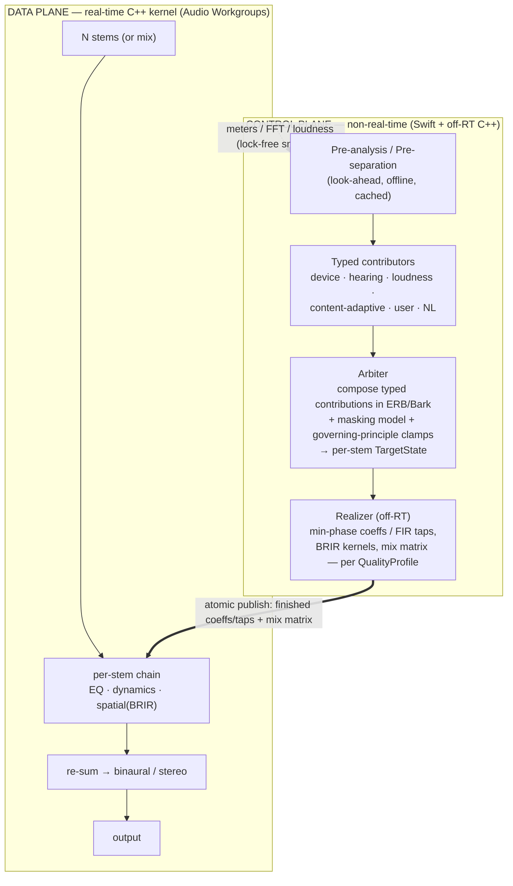

# Adaptive Sound — Architecture (v0.3)

**Status:** Canonical design · **Date:** 2026-06-13
**Supersedes:** [proposal.md](../session-notes/proposal.md) (v0.1). **Shaped by:** [proposal-review.md](../session-notes/proposal-review.md) (panel 1) + [review-v0.2.md](../session-notes/review-v0.2.md) (expert panel 2) + founder talk-through.

> **v0.3 (expert-panel fold-in):** **shared late-reverb** decomposition (not 6 independent BRIRs — the ~6× cost cut); **re-sum mixbus discipline** (loudness-matched per-stem trim); **bass + lead-vocal exempt from spatial spread**; masking re-scoped to the **excitation-pattern (ERB) subset** (full Moore-Glasberg is ~50× too slow); stems **gated on perceptual artifacts, not SDR**; BRIR room amount **content-adaptive**; Demucs **weights auto-downloaded on first run** (code MIT; NC-trained weights not redistributed), **MLX primary**; NL planned **on-device LLM + SAFE/SocialEQ priors** (mechanism still deferred) with **untrusted-output clamping**; global tap reframed as a **high-consent, captures-everything** capability. Detail: [review-v0.2.md](../session-notes/review-v0.2.md).
**Companion docs:** [prior-art.md](../session-notes/prior-art.md) · [../product/PRD.md](../product/PRD.md) · [../product/requirements.md](../product/requirements.md) · [../product/user-journeys.md](../product/user-journeys.md) · [../product/backlog.md](../product/backlog.md) · [../sprints/00-sprint-model.md](../sprints/00-sprint-model.md)

> One-line: **turn any good-quality song into a personal, perceptually-tuned, spatially-rendered mix you can steer in plain language** — on modern Macs, headphones or speakers.

---

## 0. Locked decisions & ADR registry

Canonical decision registry for the architecture. Product/scope locked decisions live in PRD §0 (LD-1…LD-10) and are extended here (LD-11…LD-19).

**Sprint Model (BA-2, locked 2026-06-13):** Development uses **sprint-based Kanban** (5–10 story points per sprint, ~1 week) instead of phase gates. Each sprint ships a locally-testable binary; manual testing occurs at sprint end before team retro; **done-done criteria are validated per sprint** (Claude asks, user picks acceptance). **Enablers ship before features** (dependency ordering). Shipping to GitHub releases is a manual decision, not automatic per sprint. Epics span multiple sprints; each sprint is independently implementable and testable.

See **[../sprints/00-sprint-model.md](../sprints/00-sprint-model.md)** for sprint sequencing, done-done templates, and team cadence details.

| LD | Decision |
|---|---|
| LD-1…LD-10 | (PRD §0) own-player→system-wide; immersive=spatial+tonal; both outputs; local-files MVP; phased content brain; on-demand mic; generic HRTF→**now BRIR, see LD-14**; Conversational Tuning (governing principle, session-scoped); personal/OSS; quality-first/ample-hardware. |
| **LD-11** | **Source quality & non-goals.** Assume reasonably good sources (lossless / high-bitrate). **Audio repair/restoration is a non-goal** (no de-noise/de-clip/upsample to "fix" bad audio). Network may be used for non-sensitive, latency-tolerant work; **core playback + RT DSP stay offline-capable.** |
| **LD-12** | **Perceptual tonal model.** Clarity/adaptive decisions are made in **ERB/Bark with a masking + partial-loudness model**, not raw dB-on-log. Contributors are **typed** (EQ-curve + per-band dynamic + transient + spatial), not a single magnitude curve. The dB curve is a *realization/interchange* format only. |
| **LD-13** | **Phase realization = minimum-phase by default.** Phase mode is chosen by **content** (transient density from pre-analysis); linear/mixed-phase is opt-in or band-limited where it genuinely helps. (Pre-ringing, not latency, is the real cost.) |
| **LD-14** | **BRIR-first immersion.** Headphone spatialization defaults to a **binaural room response** (HRTF + early reflections + late reverb); dry HRTF is a "minimal" mode. Head-tracking is **opt-in** for music. Speaker immersion = **M/S width + ambience extraction (mono-safe)**; crosstalk-cancellation is opt-in (centered near-field only). Crossfeed opt-in. |
| **LD-15** | **Stem-based object engine** (Phase 1.5). Offline **6-stem** separation (vocals/drums/bass/guitar/piano/other), cached; **full per-stem chains incl. spatial placement**, re-summed to binaural; **masking computed between stems**. **Own-player-only** (live tap path is mix-only); real-time-lite separation is a research track. |
| **LD-16** | **"Reimagine" intensity** = one continuous control. **0% = original mix, stem engine bypassed (bit-faithful, zero separation artifacts)** → rising = clarity → spatial widening → **100% = full stem-based spatial reimagining**. Crossfades original↔stem-render + scales spatial spread / unmask depth. Mix-range in Phase 1; stem-range unlocked in Phase 1.5. |
| **LD-17** | **Dynamics & loudness.** **No program DRC by default** (transparent LUFS normalization + true-peak safety limiter only). Loudness compensation = **fraction of the equal-loudness contour *difference*** + per-device SPL calibration + loudness-matched makeup, **rate-limited to volume changes**. |
| **LD-18** | **Target hardware & runtime posture.** Floor = **Apple-Silicon Pro-class (M1 Pro) with ≥16 GB**; anything that runs this is stronger. The app is the **foreground, primary activity** ("lean-back listening," not background multitasking), so it may **use multiple cores and occupy memory generously**. Supersedes the base-model-8 GB-Air framing in §15 (materially reduces that risk); still degrade gracefully if backgrounded or if other apps run. **Power:** default max-quality on AC; auto-switch to the Efficiency profile on battery (user-overridable). |
| **LD-19** | **App shape.** A focused **full-window listening experience** (now-playing + scene visualizer + the Reimagine dial) **plus a menu-bar extra** for quick control (toggle / volume / Reimagine). Both surfaces share one app-level audio engine. |

**ADRs** (details in §18): **Accepted —** 001 Foundation · 002 Phase-2 taps · 003 BRIR-first spatial · 004 BNNS-Graph RT ML · 005 vDSP feature analysis · 006 Perceptual typed-contributor model + off-RT Realizer (min-phase default) · 007 Stem object engine · 008 Reimagine intensity · 009 NL typed-macro (mechanism deferred) · 010 Dynamics/loudness policy.

---

## 1. Objectives, assumptions, non-goals

**Objective.** An **immersive** music experience on **modern capable Apple-Silicon Macs (M1 Pro / 16 GB floor and up; LD-18)**, on headphones & speakers, that lets the listener **actually hear what's being played** (clarity, detail, correct balance, externalized stage), and that **adapts dynamically** — automatically and via the user's **abstract natural-language guidelines**.

**Assumptions:** ample CPU/RAM/network (LD-10); good-quality sources (LD-11); macOS / Apple-Silicon-first; own-player latency is free (we are the clock).
**Non-goals:** audio repair/restoration (LD-11); lyrics/recommendation; Windows/DAW-plugin formats.

---

## 2. Architecture at a glance

A constant **spine**: a non-real-time **control plane** decides *what the sound should be*; a real-time **data plane** renders it. They communicate via a lock-free parameter snapshot down and a lock-free meter/analysis snapshot up.



**RT rules (every kernel line):** no heap alloc, no locks, no Obj-C/Swift runtime, no I/O; pre-allocate; bounded deterministic work per buffer; cross-thread state via atomic snapshot + ramping; the **Realizer does all design/fitting off-RT** — the kernel only ramps & runs finished coefficients.

> **Status note (built vs. target).** The diagram above is the **target** control-plane/data-plane architecture (the stem object engine is its full-fat form). The **shipped** pipeline is narrower — see **§2.5 Shipped pipeline** for what actually runs today. In short: the per-stem chain + the **perceptual** Arbiter + the **masking-driven** Realizer + masking/BRIR are **design, not yet implemented**; what ships is a stereo/N-channel two-AU graph with the EQ/Clarity/BRIR/Crossfeed/Loudness/Limiter kernel present (EQ live; Clarity/BRIR no-op stubs; Crossfeed real + default-off; Loudness/Limiter real), a live UI-driven EQ path, a steerable equal-power intensity blend, and a **control-plane `Realizer`** (off-RT, coalesces EQ + intensity intents, sole publisher) — plus a parallel bit-perfect HAL output path. The control-plane `Realizer` is **distinct from** the perceptual Arbiter + masking-driven Realizer of §4 / ADR-006, which remain design.

---

## 2.5 Shipped pipeline (Sprints 4–5b + Pure Mode + gapless)

This section documents what is **actually built**, as distinct from the target architecture in §2 and the phased design in §3–§16. **Source of truth: the code** (`Sources/AdaptiveSound/` + `Sources/AudioDSP/`); sprint records in [../sprints/](../sprints/). **Rule: if this section and the source disagree, the source wins and this section is stale — file a doc fix** (this section is a convenience snapshot, not a status board).

**Library spine (S8+, a separate subsystem — not in the audio graph above):** a persistent, **GRDB.swift-backed** `LibraryStore` (`final class … Sendable` over a GRDB `DatabaseWriter`; folder scan → metadata/artwork → FSEvents watch → id-preserving move-match) plus the S9 browse/search UI now back the player. Detail: `Sources/LibraryStore/` + [../sprints/s8-1-persistent-store-design.md](../sprints/s8-1-persistent-store-design.md) (note its SUPERSEDED storage-engine decision).

### Two output paths (mutually exclusive per playback start)

The engine (`AudioEngineBridge`) drives **two** parallel output paths; the active one is chosen at each `startAudio` call:

1. **Enhanced path (default)** — `AVAudioEngine`-hosted graph. Owns decode (`AVAudioFile`), device routing, and the render thread. Rate-mismatched files run through an explicit streaming **`AVAudioConverter` at `.max` quality** (`AudioEngineBridge+EnhancedResampler.swift`); 48 kHz files take a byte-identical `scheduleFile` passthrough.
2. **Pure Mode path (bit-perfect, opt-in)** — a HAL-direct output engine (`HALOutputEngine`, `kAudioUnitSubType_HALOutput`) that **bypasses `AVAudioEngine` entirely** and the DSP graph, opening the device in exclusive/integer mode for a bit-perfect stream. Decode is runtime-pluggable: **FFmpeg-or-Apple** (`FileDecodeSource`: Apple `ExtAudioFile` is the default and reference decoder, with `dlopen`'d FFmpeg — baked major-version guard — used only as a fallback for formats Apple can't open, e.g. Opus). User-toggled in Settings (`AudioViewModel.pureModeEnabled`); falls back to Enhanced when the device/file combination isn't viable (`evaluatePureViable`).

### The two-AU N-channel graph (Enhanced path)

```
player → effectsAU (N→N) → spatialAU ('aspz', N→M) → mainMixer
```

- **effectsAU** (`dspAudioUnit`) hosts the C++ `DSPKernel` (EQ → Clarity → BRIR → Crossfeed → Loudness → Limiter). It is **in the live graph**; the EQ stage is driven by the UI, the Loudness/Limiter stages are real, and Crossfeed is a real user-toggled stage (default-off → bit-exact), while Clarity/BRIR are no-op stubs (see "Live-graph reality" below). Intensity is a **continuous equal-power wet/dry blend** (intensity-0 = bit-exact bypass anchor; intensity-1 = full in-place chain) applied before Loudness+Limiter (`DSPKernel::process`, `DSPKernel.mm:131-235`).
- **spatialAU** (`spatialAudioUnit`, subtype `'aspz'`) is the **device-boundary render stage** that maps processing width N to device width M so the mixer no longer naively downmixes. For the shipped case **M == N**, so it is a **bit-exact identity route**; the real M < N binaural fold (S4) is **deferred**.
- The graph reconfigures to the source channel count on file load (`configureGraphForSource`; a same-count no-op for stereo) — the N-channel (≤7.1) two-AU pipeline, no naive downmix.

### Live-graph reality (read this before assuming the kernel is "the sound")

- The custom **effects AU is wired into the Enhanced graph**, and **EQ is driven live from the UI**: the drag-the-curve `FrequencyResponseCanvas` (`FrequencyResponseCanvas.swift`) commits edits to `EQViewModel` (`commitCustomBandEdits` / `applyBandGain` / `selectPreset` → `dispatchAllBands`, `EQViewModel.swift:101-110`) which calls `AudioViewModel.publishEQGains` (`AudioViewModel.swift:301`) → `engine.publishEQGains` (`AudioEngineBridge+EQControl.swift:19`) → the `publishEQBandGains` C-ABI (`AUAudioUnit.mm:419`) → `Realizer::setPendingEqGains` (`Realizer.mm:122`). Gains are hearing-safety-clamped (`EQSafetyClamp`) before reaching the kernel.
- A **control-plane `Realizer` SHIPPED** (`AudioEngine/Realizer.h` / `.mm`): a `shared_ptr`-owned, off-RT C++ object that owns the canonical `TargetState`, recomputes the EQ biquad cascade off-main, coalesces EQ + intensity intents into per-kind slots, is the **sole caller** of `publishTargetState`, and has a queue-draining teardown. This is the *plumbing* control plane only — the **perceptual Arbiter and the masking-driven Realizer of §4 / ADR-006 (typed-contributor composition, roex masking, L-M biquad fitter) remain design, not yet wired.**
- **Clarity and BRIR modules are instantiated no-op stubs** in `DSPKernel` (`ClarityModule.h` / `BRIRModule.h` — empty `process`). **Loudness is NOT a stub**: `LoudnessModule` (`Loudness/LoudnessModule.h` / `.mm`) is a real ITU-R BS.1770-5 gated-loudness worker (off-RT measurement jthread + SPSC ring) with a smoothed makeup-gain feedback path, enabled by default (`LoudnessParams.enabled = 1`, `TargetState.h:41`) and applied in `DSPKernel::process`. The **Limiter** (`LimiterModule`) is likewise real and active. (Caveat: Loudness/Limiter are wired and run in the chain, but their live audible effect is bounded by the conservative makeup law and the −1 dBTP true-peak ceiling; full perceptual tuning is later sprints.)
- **Meters / spectrum / BS.1770-5 loudness come from a Swift tap on `mainMixerNode`** (`SpectrumAnalyzer` + `LufsMeter`, `AudioEngineBridge.swift`), **not** from the C++ kernel. The Monitoring tab's per-channel before/after spectra are separate taps on the player node (before) and the effects-AU output (after).

### Gapless / continuous playback + auto-advance

- **Enhanced gapless** (`AudioEngineBridge+Gapless.swift`): resampler→resampler / passthrough→passthrough / cross-rate seams without `player.stop()`; AAC priming / MP3 LAME delay trimming is handled automatically by `AVAudioFile`/`ExtAudioFile` edit lists.
- **Pure gapless** (`GaplessSource`, C++): same-rate sample-accurate seams armed via the `pureModeEngineSetNextTrack` C-ABI; a rate/format mismatch advances with a brief reconfigure gap.
- **Auto-advance**: the view model polls `trackTransitionCount()` / `playbackEnded()` at 20 Hz (`AudioViewModel.tickSpectrum`) and arms the next on-deck track.

### Device model (pin vs. follow)

- App-selected device is **authoritative** by default. A Settings toggle (`pinPlaybackToSelectedDevice`, default `true`) chooses behaviour when a **new** device connects mid-playback: **PIN** re-asserts the selected device; **FOLLOW** adopts the newly-connected default and re-establishes playback on it.
- Resilience: an `AVAudioEngineConfigurationChange` observer re-establishes the Enhanced path after route/format changes; a `kAudioDevicePropertyDeviceIsAlive` listener **pauses** the Pure path on device loss (never auto-jumps).

### Two bit-perfect concepts (don't conflate them)

| Concept | Mechanism | Scope |
|---|---|---|
| **Intensity-0 kernel bypass** | Intensity is now a **continuous equal-power wet/dry blend** (`DSPKernel::process`, `DSPKernel.mm:131-235`): the settled `intensityLinear == 0` endpoint takes a hard early-return branch → output equals input (in-place AU); intermediate `x ∈ (0,1)` blends `cos(x·π/2)·dry + sin(x·π/2)·wet`; settled `x == 1` is the full in-place chain. | Intensity-0 is the **bit-exact** "hear exactly what's played" anchor *within the Enhanced DSP graph* (LD-16); verified by the C++ null test + golden master `0xE7267654BA01D315`. |
| **Pure Mode HAL path** | A separate `HALOutputEngine` that bypasses the whole `AVAudioEngine` graph + DSP and renders the decoded stream to the device unchanged | A user-facing, device-level bit-perfect playback mode (exclusive/integer where the device allows). Verified by `RoundTripTests` (software-chain) + on-device by ear. |

### Validation gate (the real one)

The DSP gate is the **C++ null-test harness** — `bash scripts/build-null-test.sh` (120 tests, including the S6 `RealizerTests`, `IntensityTests`, and `GaplessContractTests` suites plus later additions; stereo golden master `0xE7267654BA01D315` unchanged through S6; fixtures in `<repo>/test-data/`) — plus `swift run VerifyAUGraph` (AU-graph integration) and `swift run SRCQualityMeasure` (characterises the `.max` SRC). `swift test` runs the Swift suites headless (native swift-testing) as part of `make strict-gate`; the DSP golden-master gate, however, remains this C++ harness. See [validation-strategy.md](validation-strategy.md).

> **S6 architecture-review gate (2026-06-19):** the shipped pipeline above was hardened under the S6 review. See [../sprints/s6-architecture-review-findings.md](../sprints/s6-architecture-review-findings.md) (findings + prioritized fix list) and [../sprints/s6-tier3-spine-design.md](../sprints/s6-tier3-spine-design.md) (the Tier-3 spine: `RtSwappableResource` extraction, control-plane `Realizer`, steerable intensity, `GaplessController` conformance).

---

## 3. Foundation (ADR-001)

> **Built vs. design.** ADR-001 is **shipped** (AVAudioEngine + custom v3 AU + C++ kernel) — but see §2.5: the effects AU is in the graph with EQ driven live and a steerable intensity blend, there is now a **second** bit-perfect HAL output path that bypasses AVAudioEngine, and an off-RT **control-plane `Realizer`** owns/publishes the `TargetState`. Still design: the kernel's Clarity/BRIR modules (no-op stubs) and the **perceptual** Arbiter + masking-driven Realizer of §4 (Loudness/Limiter, by contrast, are real and active).

AVAudioEngine host + **one custom `AUAudioUnit` (v3)** whose render block calls a **C++ DSP kernel**; Swift↔C++ via **Swift/C++ interop** + small facade. AVAudioEngine owns decode, format/SR conversion, device routing, the render thread. Reference: `bradhowes/LPF` (MIT); Apple `AudioUnitSDK` (Apache-2.0). *(Shipped reality: a parallel Pure Mode HAL path bypasses this graph — §2.5.)*

## 4. The signal model — typed contributors, perceptual decisions (LD-12)

> **DESIGN — NOT YET SHIPPED.** Everything in §4 (the typed-contributor model, the **perceptual Arbiter**, the **roex / excitation-pattern masking model**, the **greedy-add + Levenberg-Marquardt biquad-cascade fitter**, the masking-driven Realizer) is **design intent**, not implemented on the current branch. What ships today: the EQ coefficient design is `computeBiquadCascade` / `EQModuleCoefficients` (not the L-M fitter described below), `ClarityModule` is a no-op stub with no masking model, and there is **no perceptual Arbiter**. **Note (do not conflate):** a *control-plane* `Realizer` SHIPPED in S6 (`AudioEngine/Realizer.h` / `.mm`) — but it is only the plumbing that owns the `TargetState`, designs the EQ cascade off-main, coalesces intents, and is the sole publisher. It is **not** the masking-driven, typed-contributor Realizer described below. The design content here is retained as the target. See §2.5 for shipped reality and [../sprints/s6-tier3-spine-design.md](../sprints/s6-tier3-spine-design.md) for the control-plane Realizer.

The tonal/spatial/dynamic state is **not** a single dB curve. Each source contributes a **typed contribution**:

| Contributor | Emits |
|---|---|
| Device correction | EQ curve (to target) |
| Hearing profile | per-ear EQ curve |
| Loudness compensation | volume-dependent EQ curve (fractional contour-diff, LD-17) |
| Content-adaptive | EQ + dynamic-EQ + (per-stem) balance moves |
| Masking/clarity | dynamic per-band gain (ERB/Bark, between-stem) |
| User manual | typed moves |
| Natural-language | typed **macro** (multi-band EQ + dynamics + transient + spatial + target-stem), governing-principle |

**Arbiter** composes contributions **in the perceptual (ERB/Bark) domain** using a masking model — the affordable **excitation-pattern / masked-threshold (ERB) subset**, *not* full time-varying Moore-Glasberg partial loudness (which is ~50× too slow per channel and has no shippable implementation) — enforces **governing-principle clamps** (locked-band/macro records written on NL-confirm, cleared on undo/session-end), and emits a **per-stem `TargetState`** (EQ curve + dynamics + transient + spatial placement + level). The **re-sum is a managed mixbus** (§9), not a passive adder.

### Masking model selection (locked: Moore-Glasberg roex, ERB-rate)

**Model choice (ADR-006 amendment):** The Arbiter uses the **roex(p) auditory filter** excitation-pattern model on the ERB-rate scale (34 bands, 50 Hz–16 kHz), fitted from Moore, Glasberg & Baer (JASA 1997) psychophysical masking data. The level-dependent slope parameter `p = p₀ × 10^{-αL}` (where `L` is excitation level in dB, `p₀ ≈ 31.5`, `α ≈ 0.008`) captures the upward spread of masking's dependence on source loudness — critical for accuracy at high listening levels. Per-band masked threshold is the excitation pattern plus an absolute threshold floor (ISO 226 Table B.1). Implementation: vDSP vector multiply-accumulate for the 34-band roex convolution per frame; ~70 floating-point operations per frame (negligible off-RT cost).

**Why this model:** (1) Matches architecture coherence (ERB bands used throughout the DSP pipeline); (2) better physics than fixed-slope alternatives (level-dependent masking slope matches auditory measurements); (3) zero computational penalty (all candidate models run in microseconds); (4) directly parameterized on ERB → natural integration with the Realizer's biquad fitting. Research shows no perceptual difference in music enhancement quality between roex and simpler spreading functions (MPEG, Bark) in this application (off-RT, frame-averaged spectra, conservative unmask targets).

**Use:** Compute excitation pattern of the masking signal(s) per frame; evaluate masked threshold per ERB band; provide the masking depth (`masking_depth[n] = E[n] - T[n]`) to the clarity and between-stem-unmasking contributors. For between-stem unmasking (Phase 1.5), compute excitation of all stems except the target and evaluate against the target's level.

### Arbiter arbitration rules (locked)

**Hierarchical composition with proportional clamping:**

1. **Governing-principle lock (confirmed NL):** When the user confirms an NL intent (e.g., "boost vocals"), the Arbiter records a locked band and direction in the `TargetState`. Auto-contributors (content-adaptive, masking, device-correction) cannot override the direction of a locked band; they may only refine *magnitude* within the band or propose moves in other bands.

2. **Additive composition (auto-contributors):** Contributions that model *different* physical phenomena (device frequency response + hearing profile + loudness compensation) are summed per ERB band. Contributions that model *the same* phenomenon with *different confidence* (e.g., two content-adaptive suggestions) select the more conservative (smaller change) or are blended by confidence weight.

3. **Proportional clamping:** If the sum of all contributions in a band exceeds the per-band hard clamp (e.g., +12 dB for low frequencies per LD-11), scale all contributions in that band proportionally rather than dropping one contributor entirely. This preserves the direction of user intent and auto-suggestions while respecting hearing-safety limits.

4. **Governing principle floor:** On session load, all locked bands are replayed at the user's confirmed values. Undo clears lock-bands and reverts to mix level. Session end clears all locks.

**Realizer (off-RT)** turns each `TargetState` into finished, ready-to-run artifacts per the active **QualityProfile**: **minimum-phase** biquad cascades (default) or **linear/mixed-phase FIR** (opt-in / content-permitting, LD-13); BRIR convolution kernels; the stem-mix matrix. *Nothing is designed/fitted on the RT thread.*

### Biquad cascade fitting (locked: greedy add + L-M optimizer, ERB-weighted)

**Goal:** Convert the Arbiter's per-ERB-band target gain curve into a cascade of **1–10 biquad filters** that approximates it with ≤±1 dB weighted error, fit in ~10 ms off-RT.

**Algorithm (greedy iterative add):**

1. **Initialize:** Start with 2 biquads initialized at the frequency with maximum target gain (peaking type, Q=1.4, gain clamped to ±6 dB). Set the L-M optimizer loose to refine these 2.

2. **Optimize:** Run Levenberg-Marquardt optimizer on all current biquads jointly (semi-analytical Jacobian: log-magnitude separability in cascade, semi-analytical per-biquad derivatives). Terminate L-M when gradient norm < 1e-5, step norm < 1e-7, or 200 iterations.

3. **Evaluate error:** Compute weighted Chebyshev-adjacent error `E_max = max_k( W[k] × |H(f_k) − G_target[k]| )` over the 34 ERB band centers. This is the **maximum weighted absolute error in dB** (not RMS), which catches localized failures in perceptually salient bands.

4. **Stop or add:** If `E_max ≤ 1.0 dB`, accept the cascade. Else if cascade has < 10 biquads, find the band `k*` with largest weighted residual, initialize a new peaking biquad at `f_erb[k*]` with gain = `residual[k*]` clamped to ±6 dB, and loop back to step 2.

5. **Finalize:** Promote the lowest-frequency biquad to a **low shelf** and the highest-frequency biquad to a **high shelf** (for cleaner sub-bass and treble rolloff). Sort all biquads by ascending center frequency. Convert all coefficients from double to float; use **Transposed Direct Form II** (TDF-II) for numerical stability on the RT thread.

**Per-biquad parameter constraints:**

| Parameter | Bounds | Reason |
|---|---|---|
| Center frequency `f0` | 50 Hz – 20 kHz | Avoid poles near Nyquist; clip to audio bandwidth |
| Q | 0.5 – 10.0 | Hard ceiling at Q=10 for numerical safety (pole radius ~0.9993); Q > 10 is perceptually implausible for music EQ |
| Gain (peaking) | −12 dB – +12 dB | Safety clamp per LD-11; if optimizer wants to exceed this, add another biquad instead |

The L-M step applies box constraints by simple clamping after each update (projected gradient).

**Error weighting function (perceptual accuracy):**

Three multiplicative components:

```
W[k] = W_ath[k] × W_erb[k] × W_intent[k]  (normalized so max = 1.0)
```

- **W_ath[k]** (absolute threshold): Suppress error in bands near or below ISO 226 absolute threshold. At nominal 75 dB SPL listening level: `W_ath[k] = 1 − sigmoid((T_q(f_k) − 75) / 10)`, where `T_q(f_k)` is the 0-phon threshold from ISO 226. Primarily down-weights <100 Hz and >12 kHz.

- **W_erb[k]** (ERB normalization): Normalize by ERB bandwidth so higher-frequency bands (wider in Hz but narrower perceptually) don't dominate. `W_erb[k] = ERB_min / ERB(f_k)`, where `ERB(f) = 24.7 × (4.37f/1000 + 1)` (Moore & Glasberg).

- **W_intent[k]** (governing principle amplification): When the Arbiter marks a band as user-confirmed (governed by NL or explicit target), weight it 4×. Arbiter annotates per-band `intent_salience ∈ [0, 1]`; set `W_intent[k] = 1.0 + 3.0 × intent_salience[k]`.

**Why weighted Chebyshev, not RMS?** Users A/B against familiar music at known levels. A single 3 dB error in the vocal band (2–5 kHz) is immediately audible even if the RMS error over all bands is 0.5 dB. Chebyshev error catches localized failures; the weighting ensures perceptually unimportant bands don't dominate.

**Convergence & timing:** Greedy initialization (starting at max-gain frequency) puts the optimizer in the right basin immediately. Typical convergence: 20–50 L-M iterations per greedy pass; 5 passes for a typical 8-dB curve = ~200 iterations total, ~5–15 ms on M1 Pro (double precision, vDSP vector math for biquad evaluation). Well within the ~1–2 second off-RT budget.

**Future optimization path (Phase 2):** Once you have a corpus of fitted cascades, train a small on-device **IIRNet** (Eghbalzadeh et al.) model to predict (target curve → biquad parameters) directly. Inference is sub-millisecond; trade L-M design flexibility for real-time responsiveness if you ever need live parameter sweeps.

## 5. The "Reimagine" intensity control (LD-16)

A single continuous knob governs *how much we transform*:

| Intensity | Behavior |
|---|---|
| **0%** | Original mix, stem engine bypassed — **bit-faithful**, zero separation artifacts (this is the "hear exactly what's played" anchor) |
| Low | Subtle masking-aware clarity + gentle BRIR externalization; sources near original places |
| Mid | Audible clarity + spatial widening; stems placed in the virtual room |
| High | Full reimagining: active per-stem spatial placement + aggressive unmask/rebalance (separation artifacts most exposed — accepted here) |

Mechanism: **crossfade original↔stem-render** + scale spatial spread / unmask depth. **Phase 1** implements the mix-level range; **Phase 1.5** raises the ceiling into the stem-based range. (Open: the exact intensity→parameter mapping curve — OQ.)

**v0.3 review fixes (mastering panel):** the **default sits low-to-lower-mid** (the musical sweet spot), not at the top. There is a small **dead-band above 0%** so leaving the bit-perfect anchor doesn't crossfade the original against an imperfect-phase stem-sum (avoids a discontinuity/comb and the mid-knob "quality valley"). The render is **loudness-matched across the whole knob** so A/B isn't biased by level. **Bass and the lead vocal are exempt from spatial spreading at every intensity** (§7).

## 6. Stem-based object engine (Phase 1.5 · LD-15)

> **DESIGN — NOT YET SHIPPED.** The stem object engine (Demucs separation, per-stem chains, between-stem masking, stem caching) is **Phase 1.5 design intent**, not implemented. The shipped pipeline (§2.5) processes the **mix**, not stems.

Pre-separation pipeline: on add/first-play, run **Demucs 6-stem** offline (**MLX primary**, Core ML secondary — STFT/complex ops don't convert cleanly; runs on GPU, ~seconds/track, latency-free), **cache stems to SSD** (FLAC; bounded LRU, ~120–160 MB/track). Code is MIT; the **model weights are auto-downloaded on first run** — NC-trained, so *not* redistributed in the repo (keeps it MIT/Apache-clean and setup one-tap, per the founder's open-source + minimal-setup steer).

**Weights download & integrity (supply-chain security):** Weights are fetched from the **official Demucs GitHub releases** (primary) with a **fallback to Hugging Face MLX-Community** if GitHub is unreachable. **Integrity verification:** use GitHub's native release checksums (typically SHA-256, published in release notes or as separate artifact files); validate the downloaded weights against the pinned hash before loading. **Failure mode:** if verification fails or both sources are unreachable, warn the user ("Separation weights unavailable; operating in mix-only mode"), disable the stem engine (fall back to mix-level DSP only), and proceed with the rest of the app functioning normally. **Updates:** users obtain new model weights by downloading a new app version (in-app weight updates deferred to far-future roadmap). The weights download happens once (on first add/play of a track); subsequent plays load from the local cache (LRU).

**Security note:** the app enforces a **code invariant** that stems are only ever derived from user-supplied local files — never from tapped audio or DRM sources (LD-15). The separation pipeline source-type is type-checked; untrusted sources (tap/aggregate) are rejected at compile time. The kernel renders **N stem-objects** — each its own EQ + dynamics + **spatial placement** — but through a **shared late-reverb tail + a cheap per-stem early/direct filter**, *not* 6 independent full BRIRs (the ~6× cost cut; §7, §15). **Bass (≲120 Hz) is high-passed out of the spatial path and summed mono; the lead vocal stays centered** (review C4). Masking/unmasking is computed **between stems** (ERB subset, §4); NL macros can **target a stem** ("bring up the guitar"). Stems are **gated on a perceptual-artifact estimate (not SDR)** — guitar/piano are the least-robust 6-stem case; poor stems fold into "other" / fewer stems, and confidence **clamps the per-track Reimagine ceiling**. **Own-player-only**, and **stems are only ever derived from user-supplied local files — never tapped/DRM audio**; the live tap path (Phase 2) is mix-level; real-time-lite separation is a research track.

## 7. Spatial / immersion (LD-14 · ADR-003)

> **DESIGN — NOT YET SHIPPED.** BRIR convolution, head-tracking, M/S width / crosstalk-cancellation are **design intent**. What ships is the device-boundary spatial render AU (`'aspz'`), and for the shipped case (device width M == source width N) it is a **bit-exact identity route** — no binaural fold yet. The Apple-native binaural fold (S4) is **deferred** behind the bit-perfect Pure-Mode pivot. See §2.5.

- **Headphones — BRIR-first.** Convolve with a **binaural room response** (HRTF + early reflections + late reverb carrying interaural difference); dry SADIE-II HRIR is the anechoic core *inside* the BRIR; headphone-correction EQ is for **timbre only** (it does not externalize). Synthesize the room (image-source + FDN) or use CC0/CC-BY IRs. **Head-tracking opt-in** (`CMHeadphoneMotionManager`, macOS 14+). Loader: `libmysofa` (BSD-3); convolution via vDSP / FFTConvolver (MIT).
  - **v0.3:** one **shared late-reverb tail across stems** + cheap per-stem early/direct filters (not one full BRIR per stem). **Room amount is content-adaptive** — less on already-reverberant material (avoid reverb-on-reverb wash that *reduces* clarity), more on dry sources. **Bass excluded from the BRIR path + summed mono; lead vocal kept centered** (depth/early-reflections allowed, not L/R spread) — binaural-izing bass or a centered vocal combs and destabilizes the phantom center.
- **Speakers.** **M/S width + ambience extraction with hard mono-compatibility** (preserve the M channel). Crosstalk-cancellation/transaural is an opt-in "centered near-field desk" mode (stereo-dipole narrow span) — never aggressive XTC blind on laptop speakers.

## 8. Tonal / EQ realization (LD-13)

Minimum-phase by default (FabFilter-style); **content-driven** phase selection (transient-dense → min-phase even in player). Linear/mixed/low-latency-linear-phase as opt-in for material where group-delay linearity matters. Realized off-RT (§4).

## 9. Dynamics & loudness (LD-17 · ADR-010)

- **Re-sum mixbus (review C3 · ADR-011):** the per-stem chains sum through a *managed bus*, not a passive adder — **per-stem makeup ≤ gain-reduction removed** (no net loudness from per-stem dynamics), a **loudness-matched per-stem trim** so the sum's loudness + spectral centroid track the intensity-0 reference, a **headroom budget** (~−6…−3 dBFS pre-limiter so the safety limiter rarely engages), and **metered limiter gain-reduction** so "transparent" is verifiable. Centered content (kick/snare/bass/lead vocal) is group-delay-aligned to limit comb filtering on re-sum.
- **Dynamics:** transparent **LUFS normalization** + a **true-peak safety limiter** (≥4× oversampling, −1 dBTP, ~1 ms look-ahead, ITU-R BS.1770-5). **No program DRC by default**; if any, prefer **dynamic EQ** over multiband compression.
- **Loudness compensation:** a **fraction** of the equal-loudness **contour difference** (ISO 226) between an assumed program reference and the actual playback level; requires a **per-device SPL calibration**; **loudness-matched makeup**; **rate-limited to volume changes** (never program dynamics). Defeatable.
- **Psychoacoustic bass:** multiband + transient/steady-state hybrid NLD, **mono-summed**, **device/SPL-gated** (only when the transducer can't reproduce the fundamental). ⚠ Patent: mono-sum avoids Waves US-11,102,577; IP review before release (OQ-16).

## 10. Adaptivity engine + pre-analysis (LD-5, LD-6)

Pure functions `signal → typed contribution`. **Pre-analysis** scans ahead (up to full track), parallelized across cores/ANE, cached: LUFS, true-peak, dynamic range, spectral balance, genre/mood, transient density, (Phase 1.5) per-stem features. **Ambient mic is on-demand only** (LD-6: ~3 s sample, then released — no continuous polling). Adaptation cadence is **conservative**: coalesced updates, slow ramps, hysteresis/deadbands; it must **never be perceived as "the EQ moving"** (a Phase-0 KPI) and must not fight intentional musical contrast.

## 11. Natural-language layer (ADR-009, refines LD-8)

Interface (mechanism deferred — OQ-11): `interpret(text, context) → { eq_bands[], dynamics?, transient?, spatial?, target_stem?, confidence } | clarification`. A NL utterance becomes a **typed multi-band macro**, optionally targeting a stem, entered as a **governing principle** (clamps the regions it touches; auto-contributors adapt around it). Seed mappings from **SAFE-DB / SocialEQ** priors; expect **low cross-user agreement** → make terms per-user-adaptable; if CLAP/LLM back-ends are used, **validate monotonicity** (some embeddings invert "warm"). `context` must **exclude** audio buffers and hearing-profile data (privacy, §14).

**v0.3 (ML panel):** the evidence leans to a **small on-device LLM + SAFE/SocialEQ priors (few-shot/RAG)** as the planned primary back-end — CLAP-embedding optimization scored ≈ random for EQ, so it's demoted to a **retrieval/reranker**; deterministic **rules are the floor**; cloud is **opt-in only**. *The mechanism itself stays deferred (OQ-11)* — only the lean is recorded. The interpreter's output is treated as **untrusted**: schema-validated + **numeric-clamped** to the governing-principle and **hearing-safety** limits (bounds prompt-injection + hallucination). `context` is a **field allowlist** — excludes audio, hearing data, **and** track identity / listening history.

**Hearing-Safety Numeric Clamps (DESIGN — NOT YET SHIPPED; design locked for Phase 0):**

> The clamp engine and the Arbiter that would enforce these do **not** exist on the current branch. This table is the **design** the Sprint 6 Arbiter will implement (and SPIKE-HEARING-SAFETY-VALIDATION will validate); it is not active in shipped playback. See §2.5.

The Arbiter (when built) enforces these clamps on all NL interpreter output to prevent hearing damage and prompt-injection:

| Parameter | Bound | Hard Clamp | Notes |
|---|---|---|---|
| **Per-band boost** | +10 dB | +12 dB | Frequency-variable: sub-bass +8 dB, bass/mid/air +10 dB, 3–5 kHz (hearing-hazard zone) +8 dB |
| **Per-band cut** | −12 dB | −15 dB | Cuts are not hearing-risk; caps prevent artifacts (notch-filter effect) |
| **Short-term loudness (3 s, BS.1770)** | −5 LUFS | Hard via re-sum scalar | Catches sustained boosts the true-peak limiter misses |
| **Integrated session loudness** | −9 LUFS (gated) | Soft clamp + transparency | Prevents accumulated NL requests from ratcheting loudness up |
| **Cumulative NL loudness change** | +12 dB | Hard; proportional scaling | Six bands at +10 dB each ≠ +10 dB overall; cap prevents surprise volume spikes |
| **Confirmation gate trigger** | +8 dB per band | UX gate | Shows magnitude explicitly; suggests volume control as primary lever |
| **Low-confidence magnitude** | ±3 dB | Conservative default | Applied when confidence < 0.5; prevents hallucinated large gains |

**Rationale:** A +10 dB bass boost at 75 dBSPL → 85 dBSPL (NIOSH 8-hour limit for hearing-hazard frequencies). The true-peak limiter catches peaks but not sustained energy boosts; the short-term LUFS ceiling handles this. Tighter cap at 3–5 kHz (+8 dB) because this is the ear's most vulnerable frequency range. Confirmation gate at +8 dB makes large boosts visible to the user, who can use the volume control (the primary lever for safe listening) instead. Phase 0 SPIKE-HEARING-SAFETY-VALIDATION will measure whether users feel +10 dB is appropriately responsive to "MUCH louder" requests or too conservative. (Sources: NIOSH criteria; WHO-ITU H.870; audio-dsp-agent analysis grounded in ISO 226 / Fletcher–Munson physics.)

## 12. ML placement

| Task | Where | Tech |
|---|---|---|
| Source separation (6-stem) | **offline** pre-pass, cached | Demucs/HTDemucs — **MLX primary**, Core ML secondary; **code MIT, weights auto-downloaded on first run** (NC-trained → not redistributed) |
| Masking (between-stem / clarity) | off-RT control | vDSP — **excitation-pattern / masked-threshold (ERB) subset** (not full Moore-Glasberg) |

### Decision tree: MLX vs. Core ML vs. mix-only

**Primary path (production):** MLX unconditionally.  
- MLX can handle STFT and complex-arithmetic operations that don't convert cleanly to Core ML.
- Runs on GPU at ~5–15 sec/track (typical file, M1 Pro hardware); acceptable latency for offline pre-pass.
- Weights auto-download once on first add/play; cached stems reuse the result.

**Secondary path (pre-release optimization only):** Core ML conversion attempted *only if* MLX proves insufficient at Phase 1.5 tuning.  
- Conditional: measure actual runtime per hardware tier (M1 Pro, M4, M5). If MLX meets perf targets, no conversion needed.
- Conversion is lossy (STFT complexity losses); only pursue if tuning data shows MLX latency is user-visible problem.
- SPIKE-SEP-QUALITY: measure sec/track at three hardware tiers; lock measurement by Phase 1.5 gate.

**Safety fallback (always enabled):** mix-only mode.  
- Triggered if weights download fails integrity check (SHA-256 mismatch), both sources (GitHub + HF) unreachable, or both ML paths error at runtime.
- Warning shown to user ("Separation unavailable; using mix-level DSP"); app proceeds with full feature set except stem chains.
- Stem features (FR-STEM-02…06) are disabled; NL macros fall back to mix-level targeting; Reimagine knob shows mix-range only.

See §6 (Weights download & integrity), FR-STEM-01 (requirements), and SPIKE-SEP-QUALITY (backlog) for details.
| Genre/mood | off-RT pre-analysis | Create ML-trained → Core ML / SoundAnalysis |
| Feature analysis (BPM/key/spectral) | off-RT | vDSP (librosa ISC as reference) |
| NL interpretation | off-RT (mechanism deferred) | rules / CLAP / on-device or cloud LLM |
| **Real-time** ML (if any) | **render thread** | **BNNS Graph** only — *contingent: no RT ML is currently needed; reserved escape hatch (ADR-004)* |

## 13. Phase 2 — system-wide (ADR-002)

Core Audio **process taps** (macOS 14.2/14.4+): muted global tap + private aggregate device → capture, run the **same kernel** (BoundedLatency profile, **mix-level**), replay — no HAL driver/sudo. AudioServerPlugIn (libASPL, MIT) is the **fallback** for older macOS. **Stem features are own-player-only**; the tap path is mix-only.

**v0.3 (security panel C9):** the muted global tap is a **high-consent, captures-everything capability** — it fires a TCC system-audio-recording prompt + the **purple recording indicator** (screen-recording-class) and ingests *all* apps' audio, **including calls**. Therefore: an explicit pre-prompt explainer; **auto-exclude/skip communication apps** (FaceTime/Zoom/Teams) by default; **tapped audio is never persisted** and never feeds stem separation; verify the exact Info.plist key (`NSAudioCaptureUsageDescription`?) + min-OS (14.2 vs 14.4) in the SDK headers.

## 14. Cross-cutting

- **Param bus:** Arbiter→Realizer publishes a **per-stem TargetState→finished-coeffs snapshot** atomically (double/triple-buffer); RT reads latest + ramps (≥50 ms). Events (load IR/stems) via SPSC. Meters/FFT/loudness up via seqlock/ring, polled by a UI timer (≥30 fps for the analyzer; ≥2 Hz for the transparency view).
- **IR hot-swap (convolver lifetime):** At session init, exactly **2 pre-allocated `ConvolverSlot` objects** (generalize to N for future per-profile IR caching). Each slot holds the full BRIR convolution engine. The active slot index is an `std::atomic<uint8_t>` published by the non-RT Realizer with `memory_order_release`, read by the RT render thread with `memory_order_acquire` (once per buffer, held for the duration). **When the Realizer must swap IRs** (Reimagine knob change, device switch, hearing-profile update), it: (1) loads new IR data into the inactive slot (entirely off-RT); (2) waits for the current crossfade to complete (≥50 ms, see below); (3) atomically stores the new active slot index. The crossfade window is strictly longer than one render callback, so the previously active slot is guaranteed idle by the time the Realizer reuses it. **No convolver slot is ever freed** — object lifetime is managed entirely by the non-RT plane. Overlapping swaps are serialized: the Realizer queues up to 1 pending swap; intermediate requests are dropped (last-writer-wins).
- **Crossfade during IR swap:** Triggered by Reimagine knob, device switch, or hearing-profile update. The **crossfade duration is tied to the parameter ramp (≥50 ms)**; both old and new IRs run for this window, crossfaded on the output. The crossfade masks any discontinuity between slots.
- **Threading / Audio Workgroups:** with up to **6 stems × full chains × BRIR convolution**, the render uses **`os_workgroup`** to fan parallel per-stem work across cores while holding the per-buffer deadline.
- **Privacy (NFR-PRIV):** mic → SPL scalar only, never transmitted; hearing profile in Phase 0 stored as simple file-based JSON (Phase 0 interim; encryption + Keychain deferred to post-MVP); cloud-LLM `context` excludes audio/hearing data; graceful offline fallback (LD-11).
- **Quality floor (NFR-QUAL):** the **bit-transparent path = intensity 0** (verified MD5-equal bypass; a *kernel-bypass* within the Enhanced graph). Distinct from the shipped **Pure Mode HAL path**, which is bit-perfect by bypassing the whole AVAudioEngine graph + DSP at the device boundary (§2.5). THD+N budget tracked across the chain; validated at 44.1/48/88.2/96 kHz.
- **Persistence:** device↔profile binding; session-scoped NL principles with explicit save; cached stems + pre-analysis.

## 15. Performance & feasibility budget ⚠ (key review target)

The ambition (6 stems × per-stem EQ/dynamics/**BRIR convolution** + masking) is the **chief feasibility risk**. Mitigations: heavy work is **off-RT** (separation, FIR/BRIR design, masking analysis — all pre-computed/cached); the RT kernel runs **fixed, partitioned convolutions** parallelized via **Audio Workgroups**; **QualityProfile** scales partition sizes / stem count / convolution length under battery/thermal. **The raised hardware floor + sole-occupancy posture (LD-18) materially reduce this risk** vs. an 8 GB fanless Air — an M1 Pro has more performance cores, a fan, and ample RAM, and the app need not share the machine. The **shared-late-reverb decomposition** (one room tail + cheap per-stem placement filters) is now the **planned approach** (v0.3, §6/§7) — it cuts the dominant convolution cost ~6× (turns "6 long convolutions" into "1 long + 6 cheap"). **Hardware context:** the shipping generation sits well above the floor — M4 (38-TOPS NE, ~120 GB/s) → M4 Pro/Max (10–12 P-cores, 273–546 GB/s, 64–128 GB) and M5 (per-GPU-core neural accelerators, ~4× M4 GPU-AI compute, 153 GB/s) — i.e. ~3–4× the floor for this AI/convolution work, so on shipping hardware the risk is **Low** and the spike is for tuning QualityProfile caps, not go/no-go. **Open:** measured per-stem RT cost, total memory for 6 cached stems + BRIR kernels, and the worst-case render budget on **the M1 Pro / 16 GB floor** (spike before Phase 1.5 — see backlog).

## 16. Phasing & Sprint Implementation

| Phase | Scope |
|---|---|
| **0 — Player MVP** | Local-file playback through the kernel; param bus; passthrough → first DSP |
| **1 — Mix-based core** | Perceptual tonal/clarity, correction, loudness-comp, adaptive engine, **BRIR** immersion, NL (typed-macro, mix-level), **Reimagine knob (mix range)** |
| **1.5 — Stem object engine** | Offline 6-stem separation + per-stem chains + spatial placement; between-stem masking; per-stem NL; **Reimagine knob (stem range)** |
| **2 — System-wide** | Process-tap path (mix-level), libASPL fallback |

### Phase 1 — sprint breakdown

> **Sprint sequencing and status are NOT tracked here.** The authoritative forward schedule (and the single prose status surface) is [../sprints/sprint-plan.md](../sprints/sprint-plan.md); the historical per-sprint design records live in [../sprints/](../sprints/). This section previously re-narrated Sprints 4/5/6 in the **old** numbering, which collides with the forward S-scheme — the old "Sprint 6" adaptive-clarity is **not** the forward-plan S6.

**Old-numbering → forward-plan mapping** (this Phase model to the sprint plan): the Phase-0/1 player + mix-core work shipped across the old Sprints 4/5/5b and the forward S6–S9 (loudness safety, 31-band live EQ, N-channel two-AU graph, Monitoring, Pure Mode + gapless, the library spine + browse UI). The perceptual **Clarity + Arbiter + loudness-compensation** — the original "Sprint 6" content — now sits in the forward plan at **S14** (loudness-comp) and **S15–S16** (masking model + Clarity/Realizer). Its engineering design is §4 / §11 of this document + [../sprints/06-sprint-6-adaptive-clarity.md](../sprints/06-sprint-6-adaptive-clarity.md) (⚠️ superseded numbering; design retained).

### Validation framework

The canonical validation strategy (per-merge gates, nightly regression, per-sprint listening panel) lives in **[validation-strategy.md](validation-strategy.md)** — that doc is authoritative; do not duplicate its gate definitions here. In brief, the DSP gate is the C++ null-test harness (`swift test` runs in `make strict-gate` but is not the DSP golden-master gate). Cross-reference: [../product/roadmap.md](../product/roadmap.md) for timeline and phase milestones.

## 17. Open questions & risks

- **Feasibility budget** (§15) — *must spike before Phase 1.5.*
- **6-stem separation quality/artifacts** (guitar/piano) — quality-gating policy.
- **Reimagine intensity→parameter mapping curve** — define & user-test.
- **Masking model** — resolved toward the **excitation-pattern / masked-threshold (ERB) subset** (v0.3, §4); remaining: exact spreading function, and whether masking-aware unmask beats naive level-match (SPIKE-MASKING-MODEL).
- OQ-11 NL mechanism (deferred) · OQ-15b/c reconciliation defaults · OQ-16 bass IP review · OQ-17 libbs2b license · OQ-18 min-phase-vs-linear per content.
- Separation isn't lossless → at high Reimagine intensity, artifacts are exposed by design; the intensity-0 anchor + quality-gating + conservative defaults manage this.

## 18. ADR details

**v0.3 amendments (expert panel — see [review-v0.2.md](../session-notes/review-v0.2.md)):** ADR-002 +tap is high-consent (TCC + purple indicator; auto-exclude comms apps; never persist); ADR-003 +shared late-reverb, content-adaptive room, bass/lead-vocal spatial exemptions; **ADR-004 → contingent** (no RT ML currently needed — reserved escape hatch); ADR-006 +masking = excitation-pattern (ERB) subset; ADR-007 +shared-reverb decomposition, MLX-primary, weights download-on-first-run, gate on perceptual artifacts (not SDR); ADR-008 +default low-to-mid, dead-band above 0%, loudness-matched across the knob; ADR-009 +planned on-device LLM + priors (CLAP demoted), output clamped/validated (mechanism still deferred). **New: ADR-011.**

- **ADR-001 (Accepted):** AVAudioEngine + single custom AU (C++ kernel), Swift/C++ interop. *Consequence:* fast to first sound; the kernel is reused in the Phase-2 tap path.
- **ADR-002 (Accepted):** Phase-2 = process taps primary, libASPL fallback. *Consequence:* no driver for most users; stem features can't apply to live audio.
- **ADR-003 (Accepted, rewritten):** BRIR-first spatial; dry HRTF = minimal mode; head-tracking opt-in. *Consequence:* externalization actually works; needs a BRIR set + room synthesis.
- **ADR-004 (Accepted):** RT ML via BNNS Graph; Core ML/Create ML off-RT. *Consequence:* RT-safe ML; analysis ML stays off the render thread.
- **ADR-005 (Accepted):** vDSP feature analysis (librosa ISC reference). *Consequence:* avoids GPL MIR libs; more engineering.
- **ADR-006 (Accepted, rewritten):** typed contributors + ERB/Bark perceptual decisions + masking model + off-RT Realizer (min-phase default, content-driven phase). *Consequence:* real clarity gains; more complex Arbiter; dB-curve demoted to realization format.
- **ADR-007 (Accepted):** stem-based object engine — offline 6-stem, full per-stem chains incl. spatial, Phase 1.5, own-player-only. *Consequence:* signature capability; large compute/feasibility risk (§15); artifacts at high intensity.
- **ADR-008 (Accepted):** single Reimagine intensity control (0 = original bypass → full reimagine). *Consequence:* one honest control spanning fidelity↔transformation; needs a tuned mapping curve.
- **ADR-009 (Accepted):** NL typed-macro interface + per-stem targeting + SAFE/SocialEQ priors; interpretation mechanism deferred. *Consequence:* unblocks downstream design while keeping the model choice open; needs a validation harness.
- **ADR-010 (Accepted):** dynamics = LUFS-normalize + true-peak limiter, no program DRC default; loudness-comp = fractional contour-difference + SPL calibration. *Consequence:* fidelity-preserving; loudness-comp needs a calibration step.
- **ADR-011 (Accepted, v0.3):** **Re-sum mixbus discipline** — per-stem makeup ≤ gain-reduction removed, loudness-matched per-stem trim to the intensity-0 reference, headroom budget pre-limiter, metered limiter GR, group-delay-aligned center. *Consequence:* tonal balance + dynamics stay honest across the Reimagine knob; the re-sum is a managed mixbus, not a passive adder.
