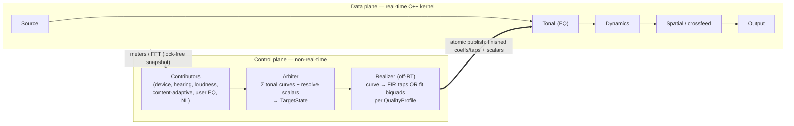

# Architecture Proposal — Adaptive Sound (for team review)

> ⚠️ **SUPERSEDED by [architecture.md](../architecture/architecture.md) (v0.2).** This v0.1 proposal is kept for provenance; the panel review that drove v0.2 is in [proposal-review.md](proposal-review.md). Read `architecture.md` for the current design.

**Status:** Draft v0.1 — SUPERSEDED · **Date:** 2026-06-13
**Related:** [prior-art.md](prior-art.md) · [../product/PRD.md](../product/PRD.md) · [../product/requirements.md](../product/requirements.md)

This proposal turns the product definition + prior-art research into a concrete technical architecture for review. Reviewers: critique it, propose refinements, and **contradict it if it's wrong** — and ground your judgments in current literature / state of the art, not just intuition.

---

## 1. Objectives, assumptions, non-goals

**Objective.** Deliver an **immersive** music experience on **modern average hardware** (headphones & laptop/desktop speakers) that lets the listener **actually hear what's being played** (clarity, detail, correct tonal balance, externalized stage), and that **adapts dynamically** — automatically, and in response to the user's **abstract natural-language guidelines** ("more punch", "vocals are buried", "too harsh").

**Assumptions (this proposal optimizes for these):**
- A1. Hardware has **ample CPU + RAM + network** to spare (LD-10). Quality beats footprint. Network may be used for non-sensitive, latency-tolerant work; core playback stays offline-capable.
- A2. **Source material is reasonably good quality** (lossless or high-bitrate lossy). We optimize *good* sources for immersion/clarity.
- A3. macOS-only; Apple Silicon first. Own-player (Phase 0–1) → system-wide via process taps (Phase 2).
- A4. In the own-player, **latency is free** (we are the clock) → look-ahead/linear-phase/oversampling are on the table.

**Non-goals (explicitly out of scope):**
- N1. **Audio repair/restoration** — de-noising, de-clipping, upsampling, or "fixing" bad/low-bitrate music is *not* an objective.
- N2. Lyrics/score understanding, music recommendation, or library management beyond what playback needs.
- N3. Windows/cross-platform; DAW plugin formats.

> Reviewers — please confirm these objectives/non-goals are the right frame, and that the design below actually serves "immersive + hear-what's-played + dynamic + abstract-guided" on good sources.

---

## 2. The spine (control plane / data plane)

One backbone carries all four product stages. The **control plane** (non-real-time, Swift + off-RT C++) computes *what the sound should be*; the **data plane** (real-time C++) *renders it*. They communicate through a lock-free param bus down and a lock-free meter/analysis snapshot up.

**RT rules (apply to every line of kernel code):** no heap alloc, no locks, no Obj-C/Swift runtime, no I/O on the audio thread; pre-allocate at init; bounded, deterministic work per buffer. Cross-thread state via atomic snapshot + ramping; events via SPSC ring.

---

## 3. Foundation (ADR-001, accepted)

**AVAudioEngine host + a single custom `AUAudioUnit` (v3) whose render block calls a C++ DSP kernel; Swift↔C++ via Swift/C++ interop with a small C++ facade.** AVAudioEngine owns file decode, format/SR conversion, device routing, and the render thread; the one custom node owns *all* DSP. The render thread stays pure C++ (interop is control-path only). Reference: `bradhowes/LPF` (MIT); Apple `AudioUnitSDK` (Apache-2.0).

---

## 4. The tonal model — a composable dB-vs-frequency curve

**Decision (this proposal's core):** the canonical tonal state is a **target magnitude curve (dB across a log-frequency grid, ~1/12-octave, 20 Hz–20 kHz)** that is the **sum of contributions** from every source. Discrete scalars (crossfeed amount, bass-enhance, dynamics params, spatial mode/HRTF set, width) ride alongside.

- **Contributors** author themselves naturally (parametric shapes for user/NL/loudness; measured curves for correction/hearing) and **rasterize onto the grid**.
- The **Arbiter** sums the grids and resolves the scalars into one **`TargetState`**.
- The **Realizer** (off-RT) turns `TargetState` into **finished coefficients** per the active `QualityProfile`: a **linear-phase FIR** (partitioned convolution) or a **fitted min-phase biquad cascade**. *The RT kernel never designs or fits — it only ramps toward and runs finished coefficients.*
- **QualityProfile (auto by context):** player session → FIR (max quality); Phase-2 tap (live) → biquads (bounded latency); battery/thermal → biquads (shorter).

Why this backbone:
- Stages 2/3/4 are not new architecture — each is **just another contributor**. Correction + loudness + adaptive + user + NL **compose by addition**; no arbitration spaghetti.
- The "unified DSP action-space" from the requirements becomes literally *a curve + a few scalars*.
- The **governing-principle** rule (LD-8): an NL instruction **clamps** its frequency region so auto-contributors can't pull against it.
- min-phase vs linear-phase is a hidden *realization* choice, not a fork.

> Reviewers — is "compose contributions as a summed dB curve, realize off-RT as FIR/biquad" sound and SOTA? Or do mature systems keep discrete parametric stages? Watch for: pre-ringing of linear-phase FIR on transients, biquad-fitting accuracy, curve-summation vs. perceptual (Bark/ERB) weighting.

---

## 5. The four product stages, mapped

| Stage | What ships | How it attaches to the spine |
|---|---|---|
| **1 — Playback** | Local-file player → output | `SRC → OUT`; kernel passthrough; param bus exists |
| **2 — EQ** | Manual + correction EQ | First contributors; Realizer + RT tonal stage |
| **3 — Dynamic adaptation** | Volume/content/device/ambient | More contributors + **pre-analysis pipeline** feeding the Arbiter |
| **4 — Abstract guidance (NL)** | "more punch", "vocals buried" | One high-priority contributor (clamps its region); interpreter behind a stable interface (mechanism deferred, OQ-11) |

---

## 6. DSP component approaches (grounded in prior-art)

| Component | Approach | Reuse / build (license) |
|---|---|---|
| **Parametric/correction EQ** | Composable curve → FIR (linear-phase) or biquad (vDSP) | vDSP + RBJ coeffs; FFTConvolver (MIT) |
| **Headphone/speaker correction** | Measured target-curve contribution | AutoEq computed curves (MIT + attribution) |
| **Loudness compensation** | Volume-dependent equal-loudness curve (ISO 226) | build on vDSP |
| **Crossfeed (headphones)** | Bauer-style; safe default for stereo relief | reimplement (libbs2b license disputed — OQ-17) |
| **HRTF binaural** | **Custom SOFA-HRIR partitioned convolution** (Apple HRTF not swappable); head-tracked | libmysofa (BSD-3) + vDSP/FFTConvolver; **SADIE II** (Apache-2.0); CMHeadphoneMotionManager (macOS 14+) |
| **Virtual room / BRIR** | Convolution with room IRs (better externalization than dry HRTF) | own/CC0-CC-BY IRs, or synthesize |
| **Dynamics / limiter** | Look-ahead (latency is free); true-peak via oversampling | LimiterClass (MIT) + Chunkware (MIT)/sndfilter (0BSD) |
| **Psychoacoustic bass** | **Mono-summed** low-band NLD harmonics (⚠ patent — Waves US-11,102,577 active; IP review req'd, OQ-16) | build (DTVBE/eloimoliner refs) |
| **Exciter / "air"** | HF harmonic generation, oversampled | Aphex_Exciter (BSD-3) |
| **Loudness/true-peak metering** | ITU-R BS.1770 | libebur128 (MIT) |

Native-first stack (LD-10): Accelerate/vDSP, AudioToolbox stock AUs where they suffice, Audio Workgroups for RT parallelism, AVAudioConverter (mastering SRC), BNNS Graph (RT ML), Core ML/Create ML (off-RT).

> Reviewers — for **immersion** (externalization) on headphones, is dry HRTF enough or is a **BRIR/virtual-speaker-in-room** approach the SOTA we should default to? For **"hear what's played" (clarity)** on good sources, what does the literature say actually helps (correction-to-target, transient/dynamic handling, masking-aware EQ) vs. snake-oil?

---

## 7. Adaptivity engine + pre-analysis (Stage 3)

- The engine is a set of pure functions `signal → contribution`, each independently testable: **volume**→loudness-comp curve; **content**→adaptive-EQ curve; **device**→correction + spatial mode; **ambient (on-demand)**→dynamics scalars.
- **Pre-analysis pipeline (the local-file advantage):** scan ahead of the playhead (up to full track), parallelized across cores/ANE, cached in RAM/SSD — loudness (LUFS), true-peak, dynamic range, spectral balance, genre/mood, problem regions. Adapt with **foresight**, not lag.
- Update cadence: event-driven; Arbiter recomputes `TargetState` on any contributor change (coalesced), publishes snapshot; RT ramps.

> Reviewers — what's the SOTA for **content-adaptive** music processing and **auto-EQ-to-a-target**? Does adapting to a target curve + loudness + ambient genuinely improve perceived quality, or risk "always fiddling"? How should multiple adaptive contributors be perceptually weighted (ERB/Bark, masking)?

## 8. ML placement

- **Real-time (render thread):** BNNS Graph only (no alloc/locks). Likely minimal in the kernel.
- **Off-RT (pre-analysis/control):** Core ML / SoundAnalysis for genre/mood (Create ML-trained on redistributable data); heavy models (e.g., Demucs source separation) are **offline-only**, a future/optional feature (LD-8).
- **NL interpretation (Stage 4):** mechanism deferred (OQ-11) behind a stable interface `interpret(text, context) → DSPActionContribution | clarification`. Could be rules, on-device model, or (network-permitted) cloud LLM.

> Reviewers — is there SOTA in **natural-language / semantic audio control** ("text → EQ/DSP") we should adopt or learn from? Any datasets/models mapping descriptive terms (warm/bright/punchy) to spectral/dynamic moves?

## 9. Phase 2 — system-wide (process taps primary)

Core Audio process taps (macOS 14.2/14.4+): muted global tap + private aggregate device → capture, run the **same C++ kernel** (BoundedLatency profile), replay — no HAL driver, no sudo. AudioServerPlugIn (libASPL, MIT) is the fallback for older macOS. (ADR-002, proposed.)

## 10. Cross-cutting

- **Param bus:** Arbiter publishes a whole `TargetState`→realized-coeffs snapshot atomically (double/triple-buffer); RT reads latest + ramps (≥50 ms). Events (load IR/FIR) via SPSC. Meters/FFT up via seqlock/ring, polled by a UI timer.
- **Profiles/persistence:** device ↔ profile binding; session-scoped NL principles with explicit save (LD-8).
- **QualityProfile:** {MaxQuality, BoundedLatency, Efficiency} selects realization + look-ahead depth.

## 11. Open questions / risks (for review)

- OQ-11 NL interpretation mechanism (deferred). OQ-15b/c reconciliation defaults. OQ-16 bass patent IP review. OQ-17 libbs2b license.
- Linear-phase FIR **pre-ringing** on transients (is auto-by-context enough, or do we need min-phase even in the player for percussive content?).
- Biquad-fitting fidelity for the BoundedLatency path.
- Curve summation in **dB on a log grid** vs. a **perceptual (ERB/Bark)** representation.
- Does the composable-curve abstraction over-constrain non-EQ effects (phase, transient, multiband-dynamics) that don't live on a magnitude curve?

## 12. ADRs

- **ADR-001 (Accepted):** AVAudioEngine + single custom AU (C++ kernel), Swift/C++ interop.
- **ADR-002 (Proposed):** Phase-2 via process taps (primary) + libASPL virtual device (fallback).
- **ADR-003 (Proposed):** Custom SOFA-HRIR convolution; default dataset SADIE II; head tracking via CMHeadphoneMotionManager.
- **ADR-004 (Proposed):** RT ML via BNNS Graph; Core ML/Create ML off-RT only.
- **ADR-005 (Proposed):** Feature analysis on vDSP (librosa as ISC reference) to avoid GPL MIR libs.
- **ADR-006 (Proposed):** Composable dB-curve tonal model + off-RT Realizer (FIR/biquad) + auto-by-context QualityProfile.

---

### What we want from each reviewer
1. **Verdict:** endorse / endorse-with-changes / contradict (with reasoning).
2. **Literature & SOTA:** what does current research/practice say — is this state-of-the-art for genuinely good immersive sound + clarity on good sources? Cite sources.
3. **Refinements:** concrete, prioritized.
4. **Contradictions/risks:** where this is wrong or sub-optimal, and the better-known alternative.
